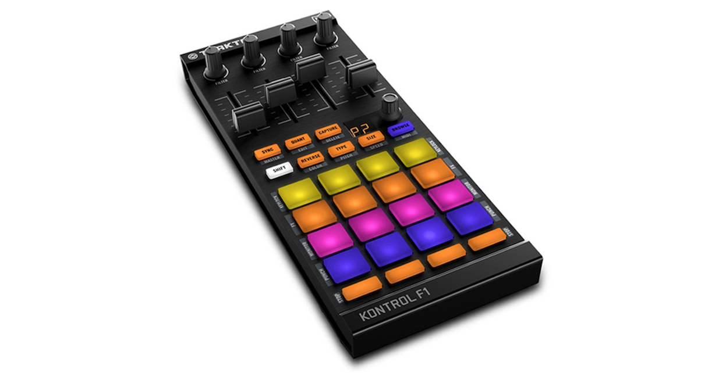

# HA-F1 — Traktor Kontrol F1 → Home Assistant via MIDI/MQTT

Use your **Native Instruments Traktor Kontrol F1** as a hardware controller for
Home Assistant. This project wires the F1's 20 pads, 4 faders, and buttons
into HA automations via MQTT — no custom firmware, no hacking, just
class-compliant USB MIDI bridged over your local network.

```
Traktor F1  →  USB  →  Linux host  →  midi2mqtt  →  MQTT broker (HA)  →  automations
```

> **macOS note:** The F1 works on macOS via **MIDI Mode** (Shift+Browse on the
> F1). Normal Traktor mode is not supported (NI's `NIHardwareAgent` intercepts
> the MIDI at driver level). When in MIDI Mode, the F1 sends CC events instead
> of note events, and works fine with midi2mqtt on macOS. See the
> [macOS Setup](#macos-setup) section and [F1 MIDI Mode](#f1-midi-mode-macos)
> for details.

---

## What's in this repo

| Path | Platform | Purpose |
|------|----------|---------|
| `config/midi2mqtt.yaml` | 🐧 Linux | Ready-to-use midi2mqtt config (standard Traktor mode) |
| `config/midi2mqtt-macos-midi-mode.yaml` | 🍎 macOS | Ready-to-use config (MIDI Mode) |
| `systemd/midi2mqtt.service` | 🐧 Linux | systemd user-service for auto-start |
| `launchagents/midi2mqtt.plist` | 🍎 macOS | LaunchAgent for auto-start |
| `home-assistant/configuration.yaml` | Both | MQTT sensor config snippet |
| `home-assistant/automations-example.yaml` | Both | Example automations (pad presses, faders, scenes) |
| `docs/f1-note-map.md` | 🐧 Linux | Full MIDI note reference (standard mode) |
| `docs/f1-midi-mode.md` | 🍎 macOS | CC mapping reference and troubleshooting |

---

## Requirements

### Hardware
- Native Instruments Traktor Kontrol F1 (USB)
- A **Linux** host with a USB port — Raspberry Pi 4/5, NUC, any Debian/Ubuntu box
  - **macOS is supported via MIDI Mode** (see note at top; requires Shift+Browse on the F1)

### Software
- **[midi2mqtt](https://github.com/bzeiss/midi2mqtt)** — the upstream bridge tool
- **Go 1.21+** (to build midi2mqtt from source), or use a pre-built binary
- **MQTT broker** — Mosquitto running inside Home Assistant (the
  [Mosquitto add-on](https://github.com/home-assistant/addons/tree/master/mosquitto)
  is the easiest path)
- Home Assistant with the **MQTT integration** enabled

### Assumptions
- Linux host (systemd-based, e.g. Raspberry Pi OS, Ubuntu, Debian)
- The F1 is recognised as a class-compliant USB MIDI device (no driver needed on Linux)
- Your MQTT broker does not require TLS (add TLS settings to the config if it does)

---

## Quick Start

### Choose your platform:

- **Linux users:** F1 works natively as a USB MIDI device in standard Traktor mode
- **macOS users:** F1 must be in [MIDI Mode](#f1-midi-mode-macos) (Shift+Browse on the F1)

Then follow the setup steps below:

---

## Step-by-step setup

### 1. Clone midi2mqtt

```bash
git clone https://github.com/bzeiss/midi2mqtt.git ~/midi2mqtt
```

### 2. Build the binary

The main package is in `cmd/`:

```bash
cd ~/midi2mqtt
go build -o midi2mqtt ./cmd/
```

Or download a pre-built binary from the
[midi2mqtt releases page](https://github.com/bzeiss/midi2mqtt/releases) and
place it at `~/midi2mqtt/midi2mqtt`.

### 3. Clone this repo

```bash
git clone https://github.com/CaptainDarkHeart/HA-F1.git ~/HA-F1
```

### 4. Configure midi2mqtt

Copy the config into place and edit it:

```bash
mkdir -p ~/.config/midi2mqtt
cp ~/HA-F1/config/midi2mqtt.yaml ~/.config/midi2mqtt/midi2mqtt.yaml
nano ~/.config/midi2mqtt/midi2mqtt.yaml
```

**You must change:**
- `mqtt_server.broker.host` — set this to your Home Assistant / MQTT broker IP address

**Verify the MIDI port name:**

```bash
~/midi2mqtt/midi2mqtt -list-ports
```

The F1 usually appears as `Traktor Kontrol F1 MIDI 1` on Linux. If it differs,
update `midi.port` in the config.

> **Security note:** Never commit passwords or credentials.
> Your `~/.config/midi2mqtt/midi2mqtt.yaml` (with real credentials) must never
> end up tracked in git. See `.gitignore` for the patterns that protect you.

### 5. Test before going live

```bash
~/midi2mqtt/midi2mqtt -test
```

midi2mqtt finds its config automatically from `~/.config/midi2mqtt/midi2mqtt.yaml`
(there is no `-config` flag). Tap pads and move faders — you should see MIDI
events printed to the terminal. Press Ctrl+C when satisfied.

### 6. Auto-start the bridge service

Choose the appropriate section for your platform:

#### 6a. macOS: Install LaunchAgent

```bash
# Update the ProgramArguments path in the plist to your actual username
nano ~/HA-F1/launchagents/midi2mqtt.plist

# Copy to LaunchAgents directory
mkdir -p ~/Library/LaunchAgents
cp ~/HA-F1/launchagents/midi2mqtt.plist ~/Library/LaunchAgents/

# Load and start the service
launchctl load ~/Library/LaunchAgents/midi2mqtt.plist

# Check it loaded successfully
launchctl list | grep midi2mqtt

# View logs if needed
tail -f /tmp/midi2mqtt.log
```

The service will now start automatically at login and restart if it crashes.

#### 6b. Linux: Install systemd user service

```bash
mkdir -p ~/.config/systemd/user
cp ~/HA-F1/systemd/midi2mqtt.service ~/.config/systemd/user/midi2mqtt.service

# Verify the ExecStart path matches where you built/placed the binary
nano ~/.config/systemd/user/midi2mqtt.service

systemctl --user daemon-reload
systemctl --user enable --now midi2mqtt

# Check it started cleanly
systemctl --user status midi2mqtt
journalctl --user -u midi2mqtt -f
```

The service will now start automatically on login and restart if it crashes.

> To run as a system service (so it starts without a logged-in user), copy to
> `/etc/systemd/system/` instead, set `User=` to your username, and use
> `systemctl enable --now midi2mqtt` (without `--user`). You may also need to
> add your user to the `audio` group for MIDI access:
> `sudo usermod -aG audio $USER`

### 7. Configure Home Assistant (Both macOS and Linux)

**Add the MQTT sensor** — open your `configuration.yaml` (or a packages file)
and paste in the contents of `home-assistant/configuration.yaml` from this
repo. Restart HA afterwards.

**Add automations** — paste or import the examples from
`home-assistant/automations-example.yaml`. Replace placeholder entities:

| Placeholder | Replace with |
|-------------|-------------|
| `light.desk_lamp` | Any light entity in your HA |
| `scene.cinema_mode` | Any scene |
| `script.good_morning` | Any script |

### 8. Verify in Home Assistant

1. Open **Developer Tools → MQTT** in HA
2. Subscribe to `midi/events`
3. Press a pad on the F1 — you should see a JSON payload appear
4. Check **Developer Tools → States** for `sensor.traktor_f1_midi_event`

---

## F1 MIDI Mode (macOS)

If you're using the F1 on macOS, you'll be using **MIDI Mode** instead of the default Traktor mode. Here's what you need to know:

### Enabling MIDI Mode

1. On the F1, hold **Shift** and press the **Browse** knob/button
2. The F1 will enter MIDI mode (note: this disables its Traktor functionality)
3. The MIDI port name changes to `"Traktor Kontrol F1 - 1 Input"`

### Key Differences

- **Event types:** MIDI Mode sends **CC (Control Change) events only** — no note_on/note_off events
- **Channel:** All events are sent on **channel 12** (zero-indexed in MIDI; channel 13 in some tools)
- **Pads:** All **20 pads** are available in MIDI mode (5 rows × 4 columns, CC 10–13, 14–17, 18–21, 22–25, 37–40)
- **Faders & Buttons:** Mapped to different CC numbers than Linux mode

For a complete CC mapping reference, see [F1 MIDI Mode Reference](docs/f1-midi-mode.md).

### Configuration for MIDI Mode

Use the macOS-specific config template:

```bash
cp ~/HA-F1/config/midi2mqtt-macos-midi-mode.yaml ~/.config/midi2mqtt/midi2mqtt.yaml
nano ~/.config/midi2mqtt/midi2mqtt.yaml
```

This config is pre-configured for MIDI Mode's port name and CC events. Then restart the midi2mqtt service:

```bash
launchctl stop com.local.midi2mqtt
launchctl start com.local.midi2mqtt
```

### Building Automations in MIDI Mode

In MIDI Mode, all controls send **CC (Control Change) events** via MQTT. The F1 has **20 pads across 5 rows** — see [F1 MIDI Mode Reference](docs/f1-midi-mode.md) for the complete CC mapping.

Trigger on the `midi/events` topic and use a template condition to check the controller number and value:

**Pad press example** (Row 1, col 1 = CC 22, value 127):
```yaml
trigger:
  - platform: mqtt
    topic: "midi/events"
condition:
  - condition: template
    value_template: >
      {{ trigger.payload_json.controller | int == 22 and
         trigger.payload_json.value | int == 127 }}
```

**Other pads:**
- Row 0 (bottom): CC 37–40
- Row 1: CC 22–25
- Row 2: CC 18–21
- Row 3: CC 14–17
- Row 4 (top): CC 10–13

**Fader movement** (any value 0-127):
```yaml
trigger:
  - platform: mqtt
    topic: "midi/events"
condition:
  - condition: template
    value_template: >
      {{ trigger.payload_json.controller | int == 6 }}
action:
  - service: light.turn_on
    data:
      brightness: "{{ ((trigger.payload_json.value | int) / 127 * 255) | int }}"
```

**Discover CC numbers:**
```bash
~/midi2mqtt/midi2mqtt -test
```

Then press pads, move faders, and note the `controller` values. See `docs/f1-midi-mode.md` for the complete reference.

---


## Building automations

Automations trigger on MQTT events from midi2mqtt. **The trigger format differs
based on your platform:**

### Linux (standard Traktor mode) — note_on/note_off events

```yaml
trigger:
  - platform: mqtt
    topic: "midi/events"
condition:
  - condition: template
    value_template: >
      {{ trigger.payload_json.event_type == "note_on" and
         trigger.payload_json.note | int == 36 }}
```

Use `docs/f1-note-map.md` for the full note number reference.

### macOS (MIDI Mode) — CC (Control Change) events

```yaml
trigger:
  - platform: mqtt
    topic: "midi/events"
condition:
  - condition: template
    value_template: >
      {{ trigger.payload_json.controller | int == 22 and
         trigger.payload_json.value | int == 127 }}
```

Use `docs/f1-midi-mode.md` for the complete CC mapping reference.

### Ready-to-use examples

See `home-assistant/automations-example.yaml` for complete worked examples with:
- Simple pad-press actions (scene activation, script execution)
- Fader-based brightness/intensity controls
- Multi-pad preset switching
- Button toggle controls

---

## LED feedback

The F1's pads have RGB LEDs that can be controlled over MIDI (SysEx / Note On
with colour values). This is **not currently implemented** — midi2mqtt is an
input bridge and does not (yet) support sending MIDI output from HA back to
the device. The F1 will still light up using its default behaviour when pads
are pressed.

Future work: a companion `mqtt2midi` bridge or a midi2mqtt output feature
could close this loop and let HA set pad colours to reflect automation state.

---

## Troubleshooting

### No MIDI events appearing in Home Assistant

1. **Check midi2mqtt is running:**
   ```bash
   systemctl --user status midi2mqtt  # Linux
   launchctl list | grep midi2mqtt     # macOS
   ```

2. **Verify MQTT broker connection:**
   - Open Home Assistant → Developer Tools → MQTT
   - Click "Listen to a topic"
   - Enter `midi/events` and subscribe
   - Press a pad on the F1 — you should see JSON payloads

3. **Check midi2mqtt log:**
   ```bash
   journalctl --user -u midi2mqtt -f  # Linux
   tail -f /tmp/midi2mqtt.log         # macOS
   ```

4. **Verify F1 is detected:**
   ```bash
   ~/midi2mqtt/midi2mqtt -list-ports
   ```

   Should show `Traktor Kontrol F1 MIDI 1` (Linux) or `Traktor Kontrol F1 - 1 Input` (macOS in MIDI Mode)

5. **Test MIDI directly:**
   ```bash
   ~/midi2mqtt/midi2mqtt -test
   ```

   Press pads — you should see CC or note events printed

### Automations not triggering

1. **Wrong CC/note numbers** — use `midi2mqtt -test` to discover actual numbers on your system
2. **Condition format** — ensure you're checking `trigger.payload_json.controller` (not `state_attr`)
3. **Value check** — button presses send value `127`, releases send `0`
4. **MQTT topic** — ensure automation is listening to `midi/events` topic

### macOS: F1 not entering MIDI Mode

- Hold **Shift** and press the **Browse** button/knob for ~2 seconds
- The F1 should beep and restart
- MIDI port name changes to `Traktor Kontrol F1 - 1 Input`
- Check with `midi2mqtt -list-ports`

---

## Upstream project

This repo depends on **midi2mqtt** by bzeiss:
[https://github.com/bzeiss/midi2mqtt](https://github.com/bzeiss/midi2mqtt)

Please star the upstream repo and report midi2mqtt bugs there, not here.
This repo only contains configuration and documentation for the F1 + HA
use case.

---

## Licence

Configuration files and documentation in this repo are released under
[MIT](https://opensource.org/licenses/MIT). midi2mqtt is a separate project
with its own licence.
